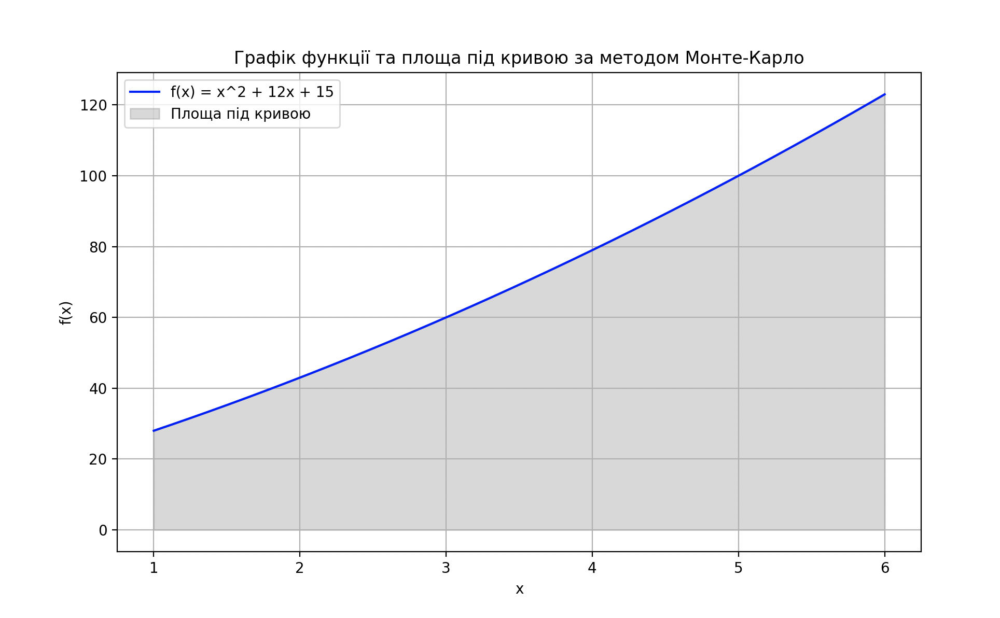

# goit-algo-hw-10

### Basics algorithms and Data Structures 
#### Master of degree from university

### Завдання 1. Оптимізація виробництва

Компанія виробляє два види напоїв: "Лимонад" і "Фруктовий сік". Для виробництва цих напоїв використовуються різні інгредієнти та обмежена кількість обладнання. Задача полягає у максимізації виробництва, враховуючи обмежені ресурси.

## Вивід програми
```
Оптимальне виробництво:
Лимонад: 30.0
Фруктовий сік: 20.0
```

### Завдання 2. Обчислення визначеного інтеграла.

Ваше друге завдання полягає в обчисленні значення інтеграла функції методом Монте-Карло.

## Вивід програми
```
Площа під кривою: 348.09
Інтеграл:  356.66666666666663
```

### Графік функції


## Висновки
Методом Монте-Карло, за допомогою функції quad з підмодуля integrate бібліотеки SciPy, були отримані наступні результати:

Оцінка площі під кривою за допомогою методу Монте-Карло складає 140.496. Результат інтегрування функції за допомогою функції quad 141.33333333333334.

Оцінка площі під кривою методом Монте-Карло наближається до значення інтегралу, отриманого аналітично або за допомогою функції quad. Різниця між цими значеннями становить приблизно 0.8373333333333335. Цe може бути пов'язана зі статистичною похибкою методу Монте-Карло, яка зменшується зі збільшенням кількості симуляцій. В результаті досліджень, можна зробити висновок, що розрахунки виконані методом Монте-Карло, є валідними та відповідають результатам, отриманим аналітично або за допомогою стандартних функцій бібліотеки SciPy.